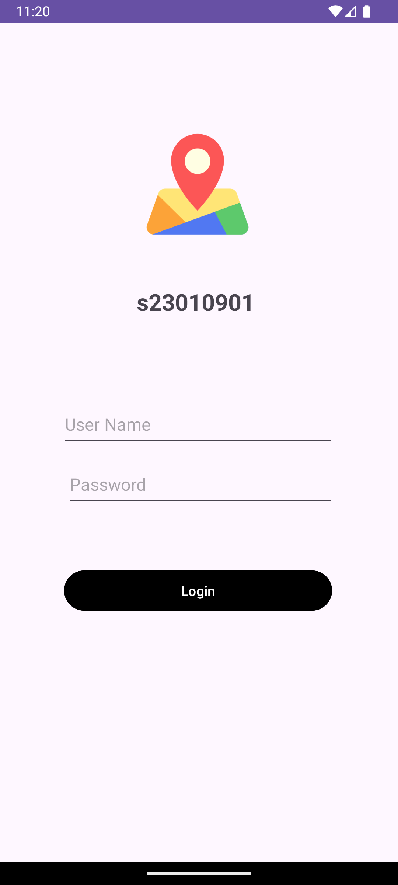
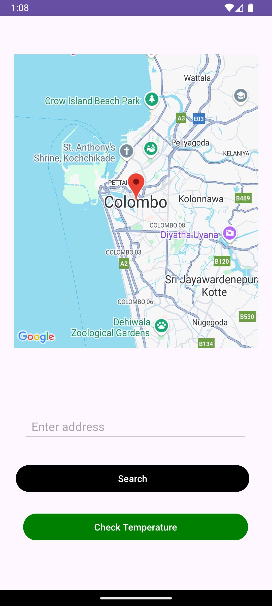
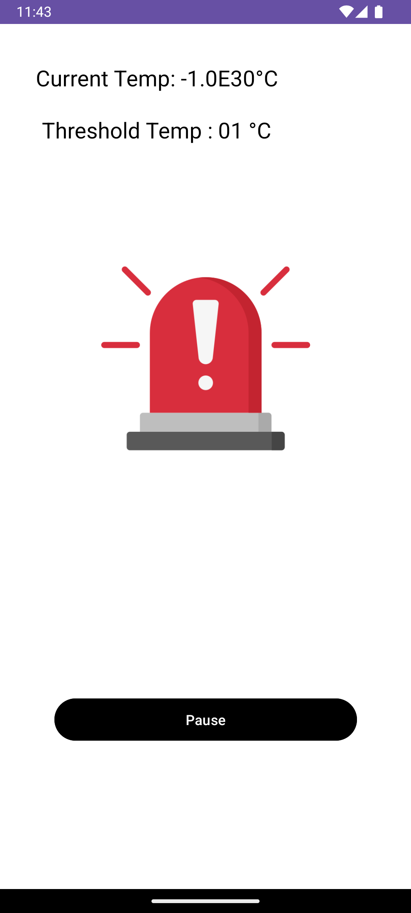

# 🌡️ Sensor-Triggered Audio & Google Maps Android App

An Android application that combines login authentication, Google Maps search, and ambient temperature sensor integration. Built for educational purposes as part of Lab 04 (Mobile Application Development).

---

## 📌 Project Overview

This app includes:
- A **login screen** with auto-registration
- A **map search screen** using Google Maps API and `Geocoder`
- A **sensor screen** that plays an offline alert sound when ambient temperature exceeds a defined threshold (based on the student ID)

---

## 🎯 Features

✅ **Login + Auto-Register System**  
- New users are automatically registered on login  
- Stored in a local SQLite database  

✅ **Google Maps Search**  
- Displays a map centered on Colombo by default  
- User can enter an address to search and mark the location on the map  

✅ **Ambient Temperature Sensor + Alert Audio**  
- Reads from the device's ambient temperature sensor  
- If temperature > `01°C` (based on SID `s23010901`) → plays a siren sound  
- "Pause" button stops the alert manually  

---

## 🧪 Screenshots

| Login Screen | Map Screen | Sensor Screen |
|--------------|------------|---------------|
|  |  |  |

---

## ⚙️ Technologies Used

- Java (Android SDK)
- SQLite (for local login system)
- Google Maps API
- Android Sensor Framework
- XML UI with ConstraintLayout
